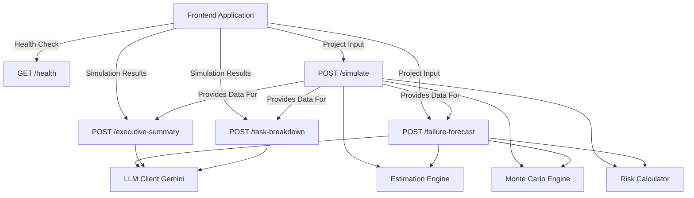
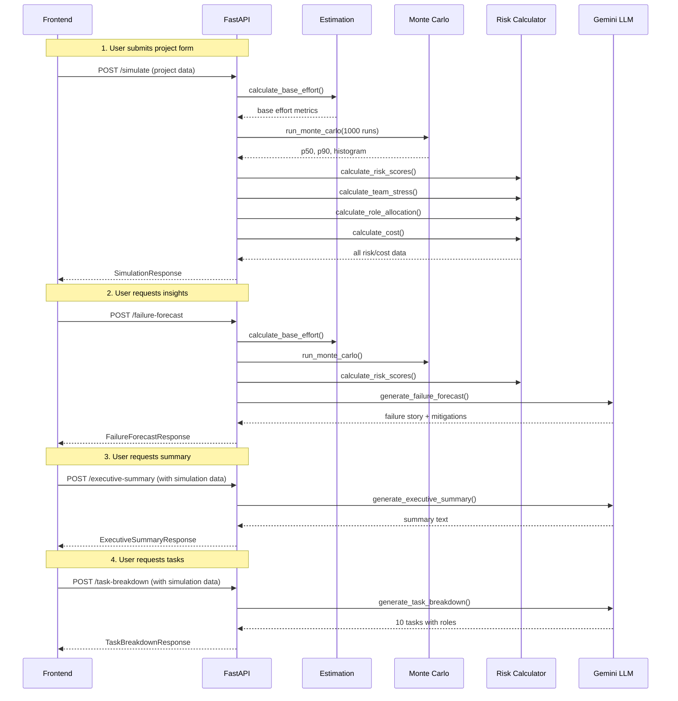

# PlanSight API - Complete Endpoint Map

**Base URL**: `http://localhost:8000` (development)  
**Interactive Docs**: `http://localhost:8000/docs`

---

## Endpoint Overview



---

## Complete Endpoint Reference

### 1. Health Check
**`GET /health`**

**Links To**:
- No dependencies
- Entry point for system health checks

**Used By**:
- Frontend health monitoring
- Deployment health probes
- Load balancer checks

**Response Links**:
```json
{
  "status": "ok"
}
```

**File Location**: [`backend/main.py`](backend/main.py) - Line ~28

---

### 2. Project Simulation (Core)
**`POST /simulate`**

**Links To Internal Modules**:
- [`backend/core/estimation.py`](backend/core/estimation.py) → `calculate_base_effort()`
- [`backend/core/monte_carlo.py`](backend/core/monte_carlo.py) → `run_monte_carlo()`
- [`backend/core/risk.py`](backend/core/risk.py) → `calculate_risk_scores()`
- [`backend/core/risk.py`](backend/core/risk.py) → `calculate_team_stress_index()`
- [`backend/core/risk.py`](backend/core/risk.py) → `calculate_role_allocation()`
- [`backend/core/risk.py`](backend/core/risk.py) → `calculate_cost()`

**Provides Data For**:
- `POST /failure-forecast` - Uses risk scores and simulation results
- `POST /executive-summary` - Uses timeline, costs, and risk metrics
- `POST /task-breakdown` - Uses risk scores and timeline estimates

**Request Schema**: [`SimulationRequest`](backend/models/schemas.py) - Line ~6
```json
{
  "project_name": "string",
  "description": "string",
  "scope_size": "small|medium|large",
  "complexity": 1-5,
  "stack": "string",
  "deadline_weeks": number,
  "team_junior": number,
  "team_mid": number,
  "team_senior": number,
  "integrations": number,
  "scope_volatility": 0-100,
  "num_simulations": 1000
}
```

**Response Schema**: [`SimulationResponse`](backend/models/schemas.py) - Line ~42
```json
{
  "on_time_probability": float,
  "expected_overrun_days": float,
  "p50_weeks": float,
  "p90_weeks": float,
  "histogram": [HistogramBucket],
  "risk_scores": RiskScores,
  "team_stress_index": int,
  "p50_cost": float,
  "p90_cost": float,
  "currency": "string",
  "role_allocation": {
    "fe": float,
    "be": float,
    "devops": float
  },
  "baseline_metrics": object
}
```

**File Location**: [`backend/main.py`](backend/main.py) - Line ~33

**Frontend Integration Links**:
- Timeline chart ← `histogram` array
- P50/P90 markers ← `p50_weeks`, `p90_weeks`
- On-time gauge ← `on_time_probability`
- Risk radar chart ← `risk_scores`
- Stress gauge ← `team_stress_index`
- Cost range ← `p50_cost`, `p90_cost`
- Pie chart ← `role_allocation`

---

### 3. Failure Forecast
**`POST /failure-forecast`**

**Links To Internal Modules**:
- [`backend/core/estimation.py`](backend/core/estimation.py) → `calculate_base_effort()`
- [`backend/core/monte_carlo.py`](backend/core/monte_carlo.py) → `run_monte_carlo()`
- [`backend/core/risk.py`](backend/core/risk.py) → `calculate_risk_scores()`
- [`backend/services/llm_client.py`](backend/services/llm_client.py) → `generate_failure_forecast()`

**Depends On Data From**:
- Uses same input as `POST /simulate`
- Can reuse simulation results internally

**LLM Connection**:
- **Model**: gemini-2.5-flash
- **API**: Google Generative AI
- **Fallback**: Intelligent risk-based generation when quota exceeded

**Request Schema**: [`SimulationRequest`](backend/models/schemas.py) - Line ~6  
(Same as `/simulate`)

**Response Schema**: [`FailureForecastResponse`](backend/models/schemas.py) - Line ~57
```json
{
  "failure_story": [
    "string (bullet point 1)",
    "string (bullet point 2)",
    "string (bullet point 3)",
    "..."
  ],
  "mitigations": [
    "string (mitigation 1)",
    "string (mitigation 2)",
    "string (mitigation 3)"
  ]
}
```

**File Location**: [`backend/main.py`](backend/main.py) - Line ~73

**Frontend Integration Links**:
- Failure modal/panel ← `failure_story`
- Mitigation cards ← `mitigations`

---

### 4. Executive Summary
**`POST /executive-summary`**

**Links To Internal Modules**:
- [`backend/services/llm_client.py`](backend/services/llm_client.py) → `generate_executive_summary()`

**Depends On Data From**:
- **Must receive results from** `POST /simulate` first
- Uses: `p50_weeks`, `p90_weeks`, `on_time_probability`, `p50_cost`, `p90_cost`, `risk_scores`, `role_allocation`

**LLM Connection**:
- **Model**: gemini-2.5-flash
- **API**: Google Generative AI
- **Fallback**: Template-based summary with actual metrics

**Request Schema**: [`ExecutiveSummaryRequest`](backend/models/schemas.py) - Line ~63
```json
{
  "project_name": "string",
  "description": "string",
  "stack": "string",
  "p50_weeks": float,
  "p90_weeks": float,
  "on_time_probability": float,
  "p50_cost": float,
  "p90_cost": float,
  "currency": "string",
  "risk_scores": {
    "integration": int,
    "team_imbalance": int,
    "scope_creep": int,
    "learning_curve": int
  },
  "role_allocation": {
    "fe": float,
    "be": float,
    "devops": float
  }
}
```

**Response Schema**: [`ExecutiveSummaryResponse`](backend/models/schemas.py) - Line ~78
```json
{
  "summary_text": "string (4-8 sentences)"
}
```

**File Location**: [`backend/main.py`](backend/main.py) - Line ~120

**Frontend Integration Links**:
- Summary card ← `summary_text`
- Copy-to-clipboard button
- Export PDF functionality

---

### 5. Task Breakdown
**`POST /task-breakdown`**

**Links To Internal Modules**:
- [`backend/services/llm_client.py`](backend/services/llm_client.py) → `generate_task_breakdown()`

**Depends On Data From**:
- **Must receive results from** `POST /simulate` first
- Uses: `p50_weeks`, `p90_weeks`, `risk_scores`

**LLM Connection**:
- **Model**: gemini-2.5-flash
- **API**: Google Generative AI
- **Fallback**: Stack-aware default task list

**Request Schema**: [`TaskBreakdownRequest`](backend/models/schemas.py) - Line ~90
```json
{
  "project_name": "string",
  "description": "string",
  "stack": "string",
  "p50_weeks": float,
  "p90_weeks": float,
  "risk_scores": {
    "integration": int,
    "team_imbalance": int,
    "scope_creep": int,
    "learning_curve": int
  }
}
```

**Response Schema**: [`TaskBreakdownResponse`](backend/models/schemas.py) - Line ~99
```json
{
  "tasks": [
    {
      "title": "string",
      "role": "FE|BE|DevOps",
      "risk_flag": "High Risk|Dependency Bottleneck|Early Validation|null"
    },
    // ... 10 tasks total
  ]
}
```

**TaskItem Schema**: [`TaskItem`](backend/models/schemas.py) - Line ~83
```json
{
  "title": "string",
  "role": "FE|BE|DevOps",
  "risk_flag": "string or null"
}
```

**File Location**: [`backend/main.py`](backend/main.py) - Line ~162

**Frontend Integration Links**:
- Task list ← `tasks` array
- Color-coded badges ← `role` (FE=blue, BE=green, DevOps=orange)
- Risk indicators ← `risk_flag`

---

## Data Flow Diagram



---

## Internal Module Connections

### Core Modules

#### 1. Estimation Engine
**File**: [`backend/core/estimation.py`](backend/core/estimation.py)

**Exports**:
- `calculate_base_effort(request: SimulationRequest) -> dict`

**Returns**:
```python
{
    "base_effort_days": float,
    "wsci": float,
    "integration_multiplier": float,
    "experience_factor": float,
    "dependency_penalty": float,
    "scope_volatility_factor": float,
    "total_team_size": int
}
```

**Used By**:
- `POST /simulate`
- `POST /failure-forecast`

**Links To**:
- WSCI stack database (lines 14-33)
- Scope base days mapping (lines 8-12)

---

#### 2. Monte Carlo Engine
**File**: [`backend/core/monte_carlo.py`](backend/core/monte_carlo.py)

**Exports**:
- `run_monte_carlo(request: SimulationRequest, base_effort: dict) -> dict`

**Returns**:
```python
{
    "p50_weeks": float,
    "p90_weeks": float,
    "on_time_probability": float,
    "expected_overrun_days": float,
    "histogram": list[HistogramBucket],
    "completion_samples": list[float]  # internal
}
```

**Used By**:
- `POST /simulate`
- `POST /failure-forecast`

**Dependencies**:
- NumPy (for fast array operations)
- Estimation results (base_effort_days)

---

#### 3. Risk Calculator
**File**: [`backend/core/risk.py`](backend/core/risk.py)

**Exports**:
- `calculate_risk_scores(request, base_effort) -> RiskScores`
- `calculate_team_stress_index(request, base_effort, mc_results) -> int`
- `calculate_role_allocation(request) -> dict[str, float]`
- `calculate_cost(p50_weeks, p90_weeks, team_size, rate) -> dict`

**Used By**:
- `POST /simulate`
- `POST /failure-forecast`

**Environment Variables**:
- `COST_RATE_PER_DEV_DAY` (default: 500.0)
- `CURRENCY` (default: "USD")

---

### Service Modules

#### 4. LLM Client
**File**: [`backend/services/llm_client.py`](backend/services/llm_client.py)

**Exports**:
- `LLMClient.generate_failure_forecast(project_context, worst_runs, risk_scores) -> dict`
- `LLMClient.generate_executive_summary(project_context, metrics) -> str`
- `LLMClient.generate_task_breakdown(project_context, risks) -> list[dict]`

**Used By**:
- `POST /failure-forecast`
- `POST /executive-summary`
- `POST /task-breakdown`

**External Dependencies**:
- Google Generative AI (`google-generativeai`)
- Model: `gemini-2.5-flash`

**Environment Variables**:
- `LLM_API_KEY` (required for AI features)
- `LLM_MODEL` (default: "gemini-2.5-flash")

**Fallback Behavior**:
- Returns intelligent responses when LLM unavailable
- No user-facing errors

---

## Frontend Integration Flow

### Recommended Call Sequence

```javascript
// 1. Start with health check (optional)
const health = await fetch('http://localhost:8000/health');

// 2. Run simulation (REQUIRED FIRST)
const simulationData = {
  project_name: "My Project",
  description: "Project description",
  scope_size: "medium",
  complexity: 3,
  stack: "React + Node",
  deadline_weeks: 10,
  team_junior: 1,
  team_mid: 1,
  team_senior: 1,
  integrations: 2,
  scope_volatility: 50,
  num_simulations: 1000
};

const simulationResponse = await fetch('http://localhost:8000/simulate', {
  method: 'POST',
  headers: { 'Content-Type': 'application/json' },
  body: JSON.stringify(simulationData)
});
const simResults = await simulationResponse.json();

// 3. Display main results
displayTimeline(simResults.histogram);
displayRiskScores(simResults.risk_scores);
displayStressGauge(simResults.team_stress_index);
displayCostRange(simResults.p50_cost, simResults.p90_cost);
displayRoleAllocation(simResults.role_allocation);

// 4. Optionally call AI insights (can be parallel)
const [forecast, summary, tasks] = await Promise.all([
  // Failure forecast
  fetch('http://localhost:8000/failure-forecast', {
    method: 'POST',
    headers: { 'Content-Type': 'application/json' },
    body: JSON.stringify(simulationData)
  }).then(r => r.json()),
  
  // Executive summary (needs simulation results)
  fetch('http://localhost:8000/executive-summary', {
    method: 'POST',
    headers: { 'Content-Type': 'application/json' },
    body: JSON.stringify({
      project_name: simulationData.project_name,
      description: simulationData.description,
      stack: simulationData.stack,
      p50_weeks: simResults.p50_weeks,
      p90_weeks: simResults.p90_weeks,
      on_time_probability: simResults.on_time_probability,
      p50_cost: simResults.p50_cost,
      p90_cost: simResults.p90_cost,
      currency: simResults.currency,
      risk_scores: simResults.risk_scores,
      role_allocation: simResults.role_allocation
    })
  }).then(r => r.json()),
  
  // Task breakdown (needs simulation results)
  fetch('http://localhost:8000/task-breakdown', {
    method: 'POST',
    headers: { 'Content-Type': 'application/json' },
    body: JSON.stringify({
      project_name: simulationData.project_name,
      description: simulationData.description,
      stack: simulationData.stack,
      p50_weeks: simResults.p50_weeks,
      p90_weeks: simResults.p90_weeks,
      risk_scores: simResults.risk_scores
    })
  }).then(r => r.json())
]);

// 5. Display AI insights
displayFailureForecast(forecast);
displayExecutiveSummary(summary);
displayTaskList(tasks);
```

---

## Environment Configuration Links

**File**: [`.env`](backend/.env) (create from `.env.example`)

```bash
# Required for AI features
LLM_API_KEY=your_gemini_api_key_here
LLM_MODEL=gemini-2.5-flash

# CORS (frontend origins)
CORS_ORIGINS=http://localhost:3000,http://localhost:5173

# Cost calculation
COST_RATE_PER_DEV_DAY=500.0
CURRENCY=USD
```

**Links To**:
- All endpoints (CORS)
- LLM Client (API key and model)
- Risk Calculator (cost settings)

---

## Documentation Links

### Setup & Getting Started
- [Backend README](backend/README.md) - Installation and setup
- [Frontend Ready Summary](FRONTEND_READY_SUMMARY.md) - Quick start for frontend
- [Start Script](backend/start.sh) - One-command server startup

### API Documentation
- [API Quick Reference](backend/API_QUICK_REFERENCE.md) - Fast lookup
- [Frontend Integration Guide](backend/FRONTEND_INTEGRATION_GUIDE.md) - Complete guide
- [Visualization Examples](backend/VISUALIZATION_EXAMPLES.md) - UI mockups
- **Interactive Docs**: http://localhost:8000/docs (when server running)

### Development
- [Backend Development Plan](BACKEND_DEVELOPMENT_PLAN.md) - Original plan
- [Implementation Summary](BACKEND_IMPLEMENTATION_SUMMARY.md) - What was built
- [Test Results](backend/TEST_RESULTS.md) - Verification report

---

## File Structure Map

```
backend/
├── main.py                     # ALL ENDPOINTS DEFINED HERE
│   ├── GET  /health           (line ~28)
│   ├── POST /simulate         (line ~33)
│   ├── POST /failure-forecast (line ~73)
│   ├── POST /executive-summary(line ~120)
│   └── POST /task-breakdown   (line ~162)
│
├── models/
│   └── schemas.py             # ALL REQUEST/RESPONSE SCHEMAS
│       ├── SimulationRequest        (line ~6)
│       ├── SimulationResponse       (line ~42)
│       ├── HistogramBucket          (line ~26)
│       ├── RiskScores              (line ~31)
│       ├── FailureForecastResponse (line ~57)
│       ├── ExecutiveSummaryRequest (line ~63)
│       ├── ExecutiveSummaryResponse(line ~78)
│       ├── TaskItem                (line ~83)
│       ├── TaskBreakdownRequest    (line ~90)
│       └── TaskBreakdownResponse   (line ~99)
│
├── core/
│   ├── estimation.py          # Base effort calculation
│   │   └── calculate_base_effort()
│   ├── monte_carlo.py         # Simulation engine
│   │   └── run_monte_carlo()
│   └── risk.py                # Risk & allocation
│       ├── calculate_risk_scores()
│       ├── calculate_team_stress_index()
│       ├── calculate_role_allocation()
│       └── calculate_cost()
│
└── services/
    └── llm_client.py          # AI integration
        └── LLMClient
            ├── generate_failure_forecast()
            ├── generate_executive_summary()
            └── generate_task_breakdown()
```

---

## External Service Links

### Gemini API
- **Endpoint**: Google Generative AI
- **Model**: gemini-2.5-flash
- **Rate Limits**: 15 req/min (free tier)
- **Documentation**: https://ai.google.dev/gemini-api/docs
- **Get API Key**: https://makersuite.google.com/app/apikey
- **Monitor Usage**: https://ai.dev/rate-limit

### Connected To
- `POST /failure-forecast`
- `POST /executive-summary`
- `POST /task-breakdown`

---

## Quick Reference Table

| Endpoint | Method | Input Type | Output Type | Depends On | Links To |
|----------|--------|------------|-------------|------------|----------|
| `/health` | GET | None | `{"status": "ok"}` | None | Health monitors |
| `/simulate` | POST | `SimulationRequest` | `SimulationResponse` | Estimation, MC, Risk | All charts |
| `/failure-forecast` | POST | `SimulationRequest` | `FailureForecastResponse` | Estimation, MC, Risk, LLM | Failure modal |
| `/executive-summary` | POST | `ExecutiveSummaryRequest` | `ExecutiveSummaryResponse` | LLM, `/simulate` results | Summary card |
| `/task-breakdown` | POST | `TaskBreakdownRequest` | `TaskBreakdownResponse` | LLM, `/simulate` results | Task list |

---

## Performance & Status

| Endpoint | Typical Time | Status |
|----------|-------------|--------|
| `GET /health` | < 1ms | ✅ Ready |
| `POST /simulate` | 80-100ms | ✅ Ready |
| `POST /failure-forecast` | 1-5s (LLM) or 50ms (fallback) | ✅ Ready |
| `POST /executive-summary` | 1-5s (LLM) or 50ms (fallback) | ✅ Ready |
| `POST /task-breakdown` | 1-5s (LLM) or 50ms (fallback) | ✅ Ready |

---

**Last Updated**: February 21, 2026  
**API Version**: 1.0.0  
**Status**: 🚀 Production Ready
