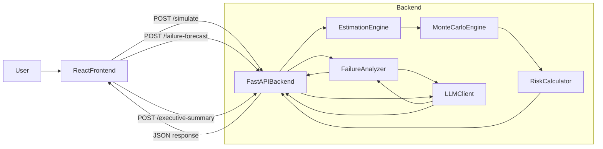

# PlanSight Hackathon MVP Plan

## 1. Problem, Audience, and Positioning

- **Problem**: Software projects routinely slip on timelines because estimation is naive (single-number guesses, no risk modeling, no link to team reality). Hackathon challenge themes (AI, productivity, dev tools) reward solutions that make delivery more predictable and data-driven.
- **Primary users**: Tech leads, founders, and PMs planning 4–16 week software projects with small teams.
- **Core positioning**: **"PlanSight simulates your project’s future before it fails."** It is not a planner or chatbot, but a predictive execution intelligence layer.
- **Judging alignment** (from common criteria):
  - **Innovation**: Probabilistic Monte Carlo modeling + failure forecasting + team stress index.
  - **Technical execution**: Real simulation engine, basic regression-based calibration, LLM used for structured task breakdown and narrative failure mode.
  - **Usefulness / Impact**: Directly addresses estimation, risk, burnout—problems judges understand.
  - **UX & Demo**: Clean single-page app with cinematic what-if animation and clear, executive-grade dashboard.

### 1.1 Alignment with Predictive Project Blueprinting System Brief

- **Intelligent Intake**: Covered by the `Project Input Form` which explicitly captures Scope, Tech Stack, Complexity, and Team Seniority (we will label this section in the UI as **"Intelligent Intake – Project DNA"**).
- **The Brain (Estimation Logic)**: Implemented as a rule-based engine starting from the brief’s formula Total\ Effort = (Base\ Complexity \times Stack\ Multiplier) \div Team\ Seniority, then extended with integration, volatility, and dependency factors.
- **Risk Profiler**: Implemented via the **Risk Profiler & Heatmap Dashboard**, which surfaces explicit percentage risk uplifts (e.g., new stack: +25% learning risk → +1.5 weeks at P90).
- **Smart Allocation**: Implemented via a **Smart Allocation** block that suggests FE/BE/DevOps role mix and effort distribution based on the chosen stack and integration profile.
- **Executive Dashboard**: Implemented as a single view that combines timeline (P50/P90, on-time probability), **cost projections**, and **resource distribution** for an executive-ready snapshot.

## 2. MVP Scope for 24 Hours (FastAPI + React)

Focus on **one insanely polished flow** instead of many half-baked ones.

### 2.1 Must-Have Features (Hackathon Demo Path)

1. **Project Input Form** (`/` main screen)

- Inputs:
  - Project name, brief description.
  - Scope size (Small / Medium / Large) and complexity (1–5 slider).
  - Tech stack (dropdown; affects stack complexity index).
  - Team composition (number of juniors/mids/seniors, roles; key: `Senior Devs`, `Total Devs`).
  - Integrations count (internal/external APIs, 0–6+ buckets).
  - Deadline (number of weeks to target completion).
- UX: Single scrollable card, live preview of "Project snapshot" on the side, explicitly labeled in the UI as **"Intelligent Intake – Project DNA"** to mirror the brief.

1. **Predictive Estimation Engine (Backend)**

- Implement in FastAPI, exposed via a single main endpoint: `POST /simulate`.
- Internal model:
  - **Base effort**: f(scope, complexity) in ideal dev-days.
  - **Weighted Stack Complexity Index (WSCI)**: pre-baked multipliers by stack (e.g., React, Next.js, Python monolith, etc.).
  - **Integration Multiplier**: factor based on number and type of integrations.
  - **Experience Variance Adjustment**: adjusts velocity based on senior/junior mix.
  - **Dependency Clustering Penalty**: penalty when many integrations + high complexity.
  - **Scope Volatility Risk Factor**: slider or checkbox ("scope likely to change?") feeding variance.
- Output base metrics (before Monte Carlo): estimated ideal days and base risk scores.

1. **Monte Carlo Simulation Engine (Core Wow)**

- For each of N runs (e.g., 1000 simulations):
  - Sample random perturbations for each risk factor (e.g., scope growth, integration delays, experience variance) from defined distributions.
  - Compute resulting project duration (in days/weeks).
- Aggregate outputs:
  - **Probability of finishing on time** (e.g., 42%).
  - **Expected overrun days** (mean delay when it misses).
  - **P50 / P90 completion dates or week counts**.
- API response returns full histogram bucket counts + summary statistics.

1. **What-If Simulator (Front-End Mic-Drop)**

- On the same page, a **What-If panel** where user can quickly tweak:
  - `Senior Dev count` (±1).
  - `Deadline` (±2 weeks).
  - `Add/remove one API integration`.
- UX:
  - Two states: **Baseline** vs **Scenario**.
  - When toggled, re-call `/simulate` with modified inputs.
  - Show animated morph of the probability curve (e.g., fading line chart or histogram that transitions from baseline to scenario).
- Outputs shown side-by-side:
  - Baseline vs Scenario: `On-time probability`, `P50`, `P90`, and `Expected overrun`.

1. **Risk Profiler & Heatmap Dashboard**

- Based on inputs + simulation outputs, compute 4 core risk scores (0–100):
  - **Integration Risk**.
  - **Team Imbalance Risk**.
  - **Scope Creep Risk**.
  - **Tooling Learning Curve Risk**.
- Show as color-coded cards or bar segments with:
  - Label, probability band (Low/Med/High), explicit risk uplift text (e.g., "New stack: +25% learning risk"), and **Estimated delay impact** in days/weeks.
- All derived from the same parameters used in the simulation (no fake numbers).

1. **Smart Allocation (Role Mix)**

- From stack and integrations, infer recommended role mix and resource distribution:
  - Example: React + Node + 3 external APIs → `{ FE: 40%, BE: 45%, DevOps: 15% }`.
- Backend returns a simple `role_allocation` structure used to:
  - Suggest which roles (FE, BE, DevOps) are needed.
  - Estimate effort share per role.
- UX: A small bar or donut chart plus text like: "Recommended: 1 FE, 1 BE, 0.3 DevOps (shared)."

1. **Failure Forecast Mode (Narrative + Numbers)**

- Button: **"Show Me How This Fails"**.
- Backend endpoint `POST /failure-forecast` (or embedded in `/simulate` response) that:
  - Extracts the worst 10–20% Monte Carlo runs.
  - Identifies which factors most frequently cause large overruns (e.g., integrations, low seniority, tight deadline).
- LLM call (to Gemini or similar) with a prompt that includes:
  - Project description, key parameters, risk scores, and common failure drivers.
  - Ask for:
    - Short narrative of the failure sequence (3–5 bullet points).
    - Top 3 mitigation actions.
- UX: Modal or side panel showing:
  - "Most likely failure scenario" steps.
  - "How to avoid it" bullets.

1. **Team Stress Index**

- Simple numeric score (0–100) derived from:
  - Timeline compression (work required / time available).
  - Role overload (tasks per dev vs reasonable threshold).
  - Parallel task density proxy (complexity + integrations per dev).
- Visualization: one gauge or card with levels (OK / Elevated / Critical) plus 1–2 mitigation suggestions.

1. **AI-Generated Task Blueprint**

- Button or tab: **"AI Task Blueprint"**.
- Backend endpoint `POST /task-breakdown` (or integrated into `/executive-summary`) that calls an LLM with:
  - Project title, description, stack, and top risk factors from the simulation.
- Output:
  - Top 10 execution tasks, each tagged with:
    - `role` (FE, BE, DevOps).
    - `risk_flag` (e.g., High Risk, Dependency Bottleneck, Early Validation).
- UX: A simple ordered list under the dashboard labeled **"AI-Generated Task Breakdown"**, satisfying the bonus requirement without over-complicating the UI.

1. **Executive One-Click Summary**

- Button: **"Generate Executive Summary"**.
- LLM call that uses all previous results to produce:
  - Project confidence score explanation.
  - P50 / P90 and overrun summary.
  - Top 3 risks and mitigations.
- UX: Simple text block + **"Copy as text"** button (no need for full PDF generation in 24h; text is enough to impress judges).

### 2.2 Nice-to-Have (Stretch if Ahead of Schedule)

1. **Historical Calibration Engine (CSV Upload)**

- Simple upload panel (`/calibrate` or a tab on main screen).
- CSV columns: `project_name, duration_weeks, team_size, senior_ratio, integrations, stack, complexity, actual_completion_weeks`.
- Backend:
  - Use scikit-learn `LinearRegression` or similar to fit coefficients.
  - Update multipliers used in the estimation model.
- Show: "Calibration applied" + small before/after example.

1. **Persisted Projects & Sharing**

- Local storage or simple in-memory ID-based share links.

1. **Auth and Multi-user**

- Likely unnecessary for hackathon; skip unless trivial.

## 3. System Architecture (High Level)

### 3.1 Components

- **Frontend**: React SPA (ideally Vite + TypeScript), hosted on Vercel/Netlify.
  - Pages/components:
    - `ProjectForm` – collects inputs.
    - `SimulationResults` – charts and metrics.
    - `WhatIfPanel` – toggles and comparison view.
    - `RiskDashboard` – risk heatmap cards.
    - `FailureForecastModal` – narrative view.
    - `ExecutiveSummaryPanel` – copyable summary.
- **Backend**: FastAPI app (`[backend/main.py](backend/main.py)`), deployed on Render/Railway.
  - Core modules:
    - `[backend/models/schemas.py](backend/models/schemas.py)` – Pydantic models for requests/responses.
    - `[backend/core/estimation.py](backend/core/estimation.py)` – base effort & risk calculation.
    - `[backend/core/monte_carlo.py](backend/core/monte_carlo.py)` – simulation logic.
    - `[backend/core/risk.py](backend/core/risk.py)` – risk heatmap & stress index.
    - `[backend/services/llm_client.py](backend/services/llm_client.py)` – wrapper for Gemini/LLM.
    - `[backend/services/calibration.py](backend/services/calibration.py)` – optional CSV-based calibration.

### 3.2 Data Flow (Mermaid)

## 4. Detailed API Design

### 4.1 `POST /simulate`

- **Request body** (Pydantic model `SimulationRequest`):
  - `project_name: str`
  - `description: str`
  - `scope_size: Literal["small","medium","large"]`
  - `complexity: int` (1–5)
  - `stack: str`
  - `deadline_weeks: int`
  - `team_junior: int`
  - `team_mid: int`
  - `team_senior: int`
  - `integrations: int`
  - `scope_volatility: int` (0–100)
  - `num_simulations: int` (default 1000)
- **Response body** (`SimulationResponse`):
  - `on_time_probability: float`
  - `expected_overrun_days: float`
  - `p50_weeks: float`
  - `p90_weeks: float`
  - `histogram: list[HistogramBucket]` (e.g., `bucket_center_weeks`, `count`)
  - `risk_scores: RiskScores` (integration, team_imbalance, scope_creep, learning_curve)
  - `team_stress_index: int`
  - `p50_cost: float` (estimated project cost at P50, using an internal rate-per-dev-day)
  - `p90_cost: float` (estimated project cost at P90)
  - `currency: str` (e.g., "USD")
  - `role_allocation: dict` (e.g., `{ "fe": 0.4, "be": 0.45, "devops": 0.15 }`)
  - `baseline_metrics: dict` (raw model internals for debugging/LLM prompts).

### 4.2 `POST /failure-forecast`

- **Request body**: Either the same as `SimulationRequest` or a reference to a recent simulation payload.
- **Backend behavior**:
  - Rerun or reuse existing simulation results.
  - Extract worst quantile and factor contributions.
  - Compose structured prompt to LLM.
- **Response**:
  - `failure_story: list[str]` (3–5 bullet points).
  - `mitigations: list[str]` (top 3 recommendations).

### 4.3 `POST /executive-summary`

- **Request body**: `SimulationResponse` + core project inputs.
- **Response**:
  - `summary_text: str` – 4–8 sentence executive summary.

### 4.5 `POST /task-breakdown`

- **Request body**: Core project inputs (title, description, stack) plus key metrics from `SimulationResponse` (top risks and P50/P90).
- **Backend behavior**:
  - Compose a concise prompt to the LLM asking for a set of 10 implementation tasks ordered by impact/critical path.
  - Tag each task with an inferred role and risk flag.
- **Response**:
  - `tasks: list[TaskItem]`, where each task has `title: str`, `role: str`, `risk_flag: Optional[str]`.

### 4.4 (Stretch) `POST /calibrate`

- Upload CSV file or JSON data.
- Run regression and update coefficients in memory for this backend instance.

## 5. PRD: User Stories and Flows

### 5.1 Primary User Story (Demo Path)

1. As a **tech lead**, I open PlanSight, paste my project info, and specify my team and deadline.
2. I click **"Run Simulation"** and immediately see:

- Probability of finishing on time.
- P50 / P90 completion estimates.
- Risk heatmap and Team Stress Index.

1. I tweak **"Remove 1 senior dev"** and watch the curve and metrics worsen live.
2. I click **"Show Me How This Fails"** and see a realistic failure narrative with mitigations.
3. I review the **AI-Generated Task Breakdown** to see the first 10 recommended execution tasks with their roles.
4. I click **"Generate Executive Summary"** and copy a ready-to-use summary for my leadership, including timeline, cost, and resource highlights.

### 5.2 Supporting Stories

- **What-If Scenarios**: As a PM, I want to test adding another engineer vs extending the deadline to see which has more impact on delivery risk.
- **Burnout Awareness**: As a team lead, I want a simple indicator when my plan is pushing my team into a burnout zone.
  -. **AI Task Blueprint**: As an engineering manager, I want the system to generate the first 10 tasks mapped to FE/BE/DevOps so my team can start execution immediately after the blueprint is approved.

### 5.3 Non-Functional Requirements (Hackathon-Friendly)

- **Performance**: `/simulate` responds in < 1s for 1000 Monte Carlo samples.
- **Reliability**: Graceful errors; frontend shows friendly message if backend fails.
- **Simplicity**: No login required; single-page experience.
- **Deployability**: Single-command deploy scripts; environment variables for LLM key.

## 6. 24-Hour Build Plan (4-Person Team Using AI)

Assume roles:

- **Person A – Product & Simulation Lead** (PM + light data science).
- **Person B – Backend Engineer (FastAPI)**.
- **Person C – Frontend Engineer (React)**.
- **Person D – AI & DevOps / Glue Engineer**.

### 6.1 Hours 0–2: Alignment & Skeleton

- **All**
  - Finalize scope (this PRD) and live demo story.
  - Sketch UI wireframe on paper or Figma.
- **B & C**
  - Set up repos: `[backend/]` FastAPI, `[frontend/]` React (or Vite React TS).
  - Configure basic `/health` endpoint and fetch from frontend.
- **D**
  - Set up deployment targets (Render/Railway for backend, Vercel/Netlify for frontend).
  - Prepare .env templates for LLM keys.

### 6.2 Hours 2–6: Core Simulation Engine + Basic UI

- **A**
  - Define exact formulas and coefficients for:
    - Base effort, WSCI, Integration multiplier, Experience variance, Scope volatility factor, Stress index.
  - Draft LLM prompts for failure forecast and executive summary.
- **B** (heavy AI assistance for code)
  - Implement `SimulationRequest/Response` models, `/simulate` endpoint.
  - Implement base estimation + Monte Carlo logic.
  - Add unit-like quick tests in a notebook or script to validate distributions.
- **C**
  - Implement `ProjectForm` with validation.
  - Mock call to `/simulate` and render dummy charts/cards for metrics.
- **D**
  - Integrate real FastAPI endpoint into frontend; handle loading and error states.

### 6.3 Hours 6–12: What-If, Risk Heatmap, Stress Index

- **A**
  - Tune risk thresholds and mapping to Low/Med/High bands.
- **B**
  - Extend `/simulate` to return `risk_scores` and `team_stress_index`.
  - Add any helper functions needed for what-if scenarios.
- **C**
  - Build `WhatIfPanel` with Baseline vs Scenario toggles.
  - Implement animated curve morph (use existing chart library transitions).
  - Build `RiskDashboard` cards with clear color-coding.
- **D**
  - Help optimize API performance, ensure CORS and env configs.

### 6.4 Hours 12–18: Failure Forecast & Executive Summary

- **A**
  - Finalize prompts and test them with sample JSON from backend.
- **B**
  - Implement `/failure-forecast` and `/executive-summary` endpoints, using `llm_client`.
- **C**
  - Build `FailureForecastModal` and `ExecutiveSummaryPanel` UI.
- **D**
  - Implement `llm_client` with streaming or simple calls.
  - Securely manage API keys; verify from deployed environment.

### 6.5 Hours 18–22: Polish, Demo Scripting, Stretch

- **All**
  - Run through demo script multiple times.
  - Ensure one golden-path scenario (baseline + what-if + failure forecast + summary) is flawless.
- **A**
  - Prepare pitch outline and slides (problem, solution, live demo, differentiation, future work).
- **B & D**
  - If time: implement simple `/calibrate` with CSV upload.
- **C**
  - Refine styling (consistent design system, spacing, typography) and responsive layout.

### 6.6 Hours 22–24: Final Pitch & Submission

- **All**
  - Record or rehearse 90-second live demo.
  - Freeze features; focus only on bug fixes.
  - Fill in submission text (problem, solution, stack, differentiation, link to repo and live demo).

## 7. Success Metrics (for Judges & Ourselves)

- **Demo success**: Live demo runs flawlessly in one take; what-if toggle visually and numerically impresses.
- **Clarity**: Judges can restate what PlanSight does in one sentence: "It simulates project timelines with probabilities and shows how they fail."
- **Technical depth**: At least:
  - Real Monte Carlo simulation.
  - Risk scoring tied to inputs.
  - LLM-backed narrative components.
- **Polish**: Clean UI, fast responses, no obvious broken states.

## 8. Q&A Defense Points

- **"How accurate is this?"** – It uses structured risk factors and Monte Carlo sampling. With time, teams can upload historical projects to calibrate it (and we already have a path for that in the architecture).
- **"Why AI, not just formulas?"** – Formulas drive the numbers; AI is used only where it adds unique value: producing nuanced task breakdowns, failure narratives, and executive summaries.
- **"Could this be a real product?"** – Yes; next steps include deeper calibration, integrations with Jira/Linear, and continuous re-simulation as tasks complete.
